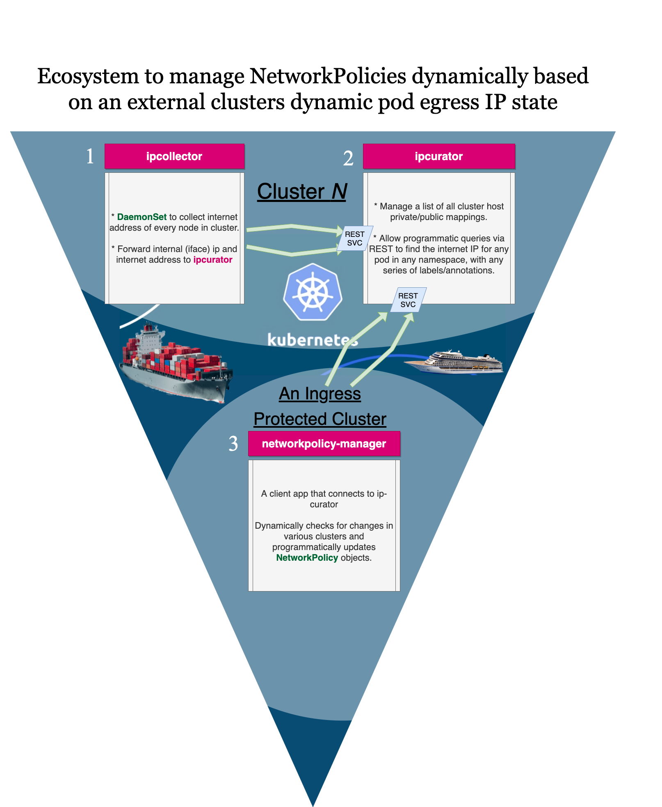
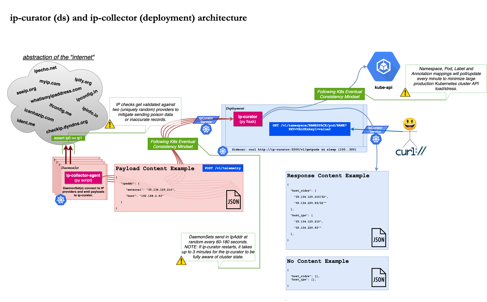
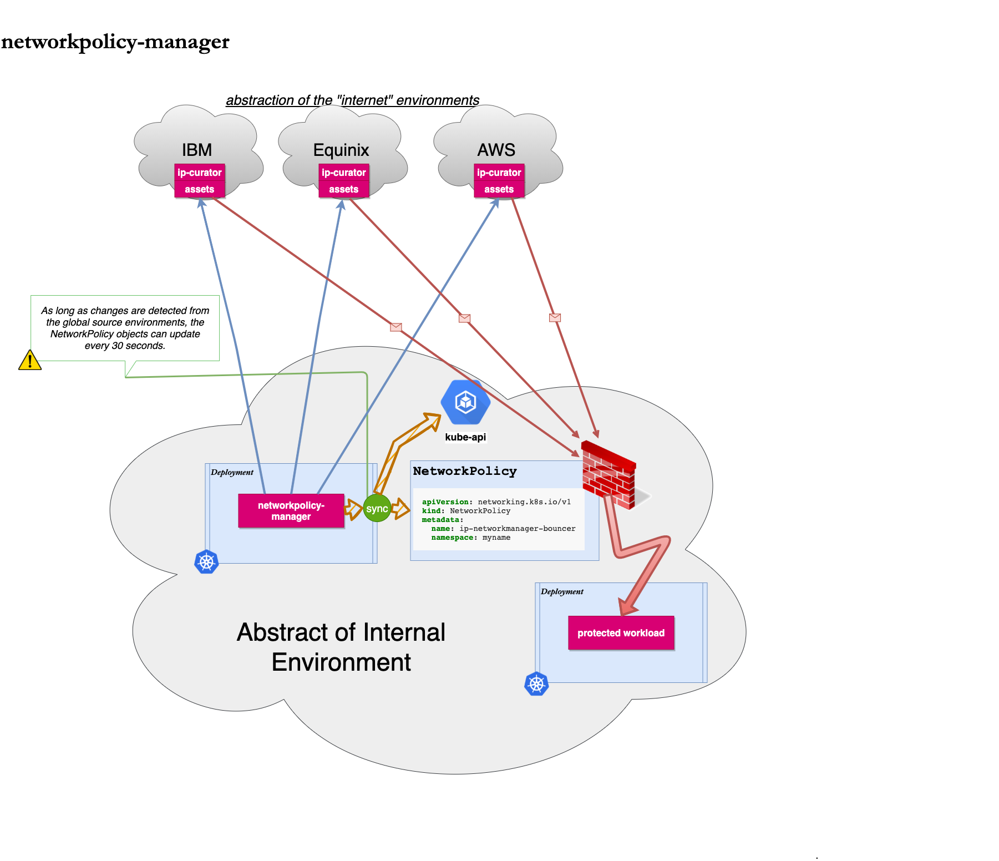

# k8s-egress-networkpolicy-manager

Kubernetes toolset allowing various external egress IP discovery methods and whitelisting of pod egress between clusters with NetworkPolicy

---

## Introduction

### What this solves

When you happen to manage k8s in a variety of cloud platforms (such as Equinix, IBM, AWS or Azure.) You run into some problems, SNAT or Egress IPs would be managed differently if it's supported at all.

This project goal is to support all environments cloud agnostically as a way to inform external clients the egress IP ranges for various pods in a kubernetes cluster. As a bonus, this project includes a networkpolicy-manager deployment that can connect to the ipcurator service to whitelist ingress from a neighboring cluster.

This tool solves for the issue of revisiting our network CNI choice for a simple matter of whitelisting services in neighboring clusters.

### How this solves it

This tool works by running a small `ipcollector` daemonset in every cluster and collects the IP address using public services†. There is a deployment called `ipcurator` which determines the smallest set of CIDRs to describe each IP address. This tool can be queried using a REST API to discover the egress IP CIDRs for pods, namespaces, or even the entire cluster. This tool is 100% cloud provider agnostic.

† 2 or more external public IP providers to determine the egress IP for each node in your kubernetes cluster.

### Architecture Diagrams

### Component Documentation

ipcollector, ipcurator, networkpolicy-manager have their own respective documentation files around the features and capabilities of each component.

Read more:

* [docs/ipcollector](docs/ipcollector.md)
* [docs/ipcurator](docs/ipcurator.md)
* [docs/networkpolicy_manager](docs/networkpolicy_manager.md)

## Quick Start Guide

### Unit Tests

    make test

### Run in minikube

This will start all the services in a single minikube cluster for testing or demo purposes.

    make minikube

### Install

These kubernetes manifests will work to install something quickly:

    kubectl apply -f deployments/ipcollector/kubernetes/manifest.yaml
    kubectl apply -f deployments/ipcurator/kubernetes/manifest.yaml
    kubectl apply -f deployments/networkpolicy_manager/kubernetes/manifest.yaml

### Contributing

Contributers are very welcome. Feel free to make PR's or create issues and we will review and address ASAP!

